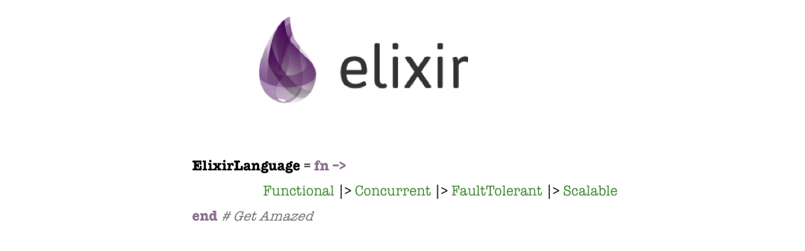
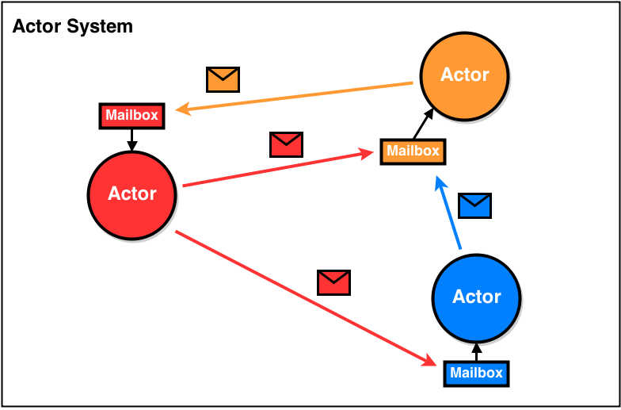

# Meet up

## Tematica sobre concorrencia e multitasking

### Reflexão

Voce ja parou pra pensar sobre o que voce realmente faz? Todos os dias nós sentamos em nossas mesas
e começamos a programar, e sempre achamos que a nossa atividade é puramente logica e opaca, sem uma razão
de ser maior. Mas o ato de programar é maior do que voce pensa!

Vou te provar, imagine que temos o seguinte grafo conexo.

> [A] -> [B] -> [C]

Esse grafo representa a entrada da informação em nosso sistema atraves do node [A] e a saida atraves do node [C].
Agora imagine que esse caminho percorrido seja perfeito, mas por diversos motivos agora o seu sistema precisa suportar
um novo caminho para a informação percorrer, descrito por:

> [A] -> [D] -> [C]

O novo caminho -ADC- porem, esconde um problema terrivel em [D] que inevitavelmente ira crashar todo o seu sistema,
mas aqui vai uma boa noticia, a chance do caminho ADC ser percorrido é de 0,000000000000000001.

Mas entao esta tudo certo, nao teremos problemas certo? Errado!

Voce ainda nao tem uma informaçao fundamental, a taxa da quantidade de informacao que adentra o seu sistema.
Entao digamos que o seu sistema receba 1000000/min hits, quanto tempo até o seu sistema crashar?

Parece que estamos condenados certo? E sim, nós estamos fadados ao fracasso!

> Nesse trabalho, nós tentamos salvar o maximo numero de pessoas possivel. Mas as vezes nao significa todo mundo,
mas ainda assim nós nao desistimos.
Capitão America - Vingadores Guerra Civil


O Capitão esta certo, nosso trabalho é minimizar ao maximo o numero de bugs possiveis. Mas nunca significara todos.
Agora, eu prometi um pouco de filosofia pra voces e aqui vai. Existe uma lei que rege tudo isso, é a **Lei de Murphy**.


###### Lei de Murphy

Voce sempre deve ter ouvido falar que a lei de Murphy se trata de:
> Tudo que pode dar errado, vai dar errado.

Mas mesmo agora nós demos outro significado para ela:
> Tudo que pode acontecer, **VAI ACONTECER**.

Sim, o que nós exemplificamos naquele exemplo do trafego de informaçao nos diz isso. Se ouver qualquer bug escondido no nosso sistema, qualquer falha por menor que seja, ela eventualmente ira acontecer se passar tempo suficiente. Esse exemplo é de Sistemas Distribuidos mas nos diz muito sobre o que fazemos.

### Concorrencia

Nosso foco aqui sera em Concorrencia, mas a gente sempre atrela esse tema a outro muito conhecido tambem, o **Paralelismo**. Mas diz ai, voce sabe a diferença entre eles?

Os bugs causados por concorrencia sao geralmente muito prejudiciais, e para escrever sistemas complexos e que agregam muito valor nós inevitavelmente vamos nos deparar com eles. Nosso foco principal quando falamos em concorrencia sao três:

- Threads
- Schedulers
- Locks

##### Threads

Threads sao branchs em **processos**(isso aqui vai ser importante daqui a pouco) e significam a menor sequencia de instruçoes independentes contraladas pelo **Scheduler**.

##### Schedulers

Sao responsaveis por organizar a execucao dos processos na CPU. Eles trabalham no regime de estrategias especificas do processador, podemos citar:

- Preempcao: O processo é interrompido espontaneamente para dar lugar a outro processo para ser executado.
- Cooperacao: O processo voluntariamente cede lugar a outro para ser executado.

Existem outras estrategias, como tambem os Schedulers sao classificados de varias formas que nao convem analisar aqui. A maioria das maquinas trabalham em regime preemptivo, entao basta contralarmos o Scheduler que estamos bem? Errado!

Schedulers e preempçao sao coisas nebulosas, e geralmente o caminho nao é tentar controlar-los, vamos deixar eles trabalharem e nos preocupar apenas com o nosso codigo.

##### Locks

Bom, o que posso dizer sobre Locks? Nao use!

Vamos la, nós vivemos em um mundo concorrente/assincrono, as coisas acontecem de forma independente ao nosso redor e nós somos comunicados atraves dos nosso sensores, entao o mundo funciona atraves de interações e **mensagens**(vai ser importante).

Agora imagine que para eu me mover, eu precise esperar voce se mover. E para a pessoa que esta ao meu lado se mover, ela precise esperar eu me mover, e assim sucessivamente. O que isso te diz?

> Locks sao lentos em ordem de magnitude.

Locks sao geralmente empregados para proteger regiões criticas do seu sistema, como inserções e atualizações no **estado**(vamos falar disso ja) da sua aplicação, problemas serios como **Data Race** sao inadmissiveis em qualquer aplicacao que ira ser exposta ao mundo real e para evita-los nós temos os Locks, pro bem ou pro mal.

###### The trouble with state

Toda aplicaçao que gera valor precisa garantir um **estado consistente**, que geralmente significa dado uma sequencia de eventos que produzam **efeitos colaterais**, os nossos dados nao estejam corrompidos e estejam de acordo com a realidade. Seria maravilhoso escrever sistemas apenas com funcoes **puras**, mas esse jamais sera o caso e nós sempre precisaremos lidar com isso.

Locks devem ser evitados a todo custo, mas como vimos eles sao uma opçao para a garantia de um estado consistente na nossa aplicaçao.

### O mundo é assincrono

Como eu descrevi anteriormente, nós nao precisamos sincronizar as coisas a nossa volta para que elas coexistam. Basta apenas que sejamos informados de alguma forma que elas ocorreram, ao interagir com o mundo a nossa volta nós estamos sempre trocando mensagens.

#### Mensagens

Voce ja deve estar percebendo que o objetivo maior para lidar com concorrencia é de alguma forma sincronizar as coisas a nossa volta. Para isso existe o conceito de mensageria.

Basicamente nós assumimos que tudo funcionara de forma assincrona e nós iremos abraçar isso, e a **comunicação e compartilhamento** de memoria e outros recursos sera dada atraves de mensagens.

> Nao se comunique compartilhando memoria, compartilhe memoria se comunicando.
Rob Pike - Criador do Go.

Nós ja sabemos que estado compartilhado é ruim, entao agora todos os processos estaram isolados e apenas enviarão mensagens entre si. Mas onde acontece a sincronia?

##### Mail Boxes

Sincronia te lembra fila? Pois é o caso aqui, todos os nossos agentes teram caixas de mensagens onde seram armazenadas e processadas sincronamente para garantir o estado consistente do agente.

### Paradigm Shift

Agora parece que os problemas estao diminuindo certo? Pois bem, esse é um mundo novo a ser explorado por todos nós.
O exemplo que iremos explorar agora trata desse novo paradigma.

#### Demonstrando

Para exemplificar tudo que foi dito vamos usar o exemplo classico bancario. Nós queremos fazer saques e depositos mas mantendo o estado da conta consistente.

Primeiro vamos ver o pior caso possivel, esse caso nao existem locks nem nenhum outro mecanismo de sincronia para as operacoes:

```go
// Funcao de Saque direto da conta
func Saque(conta *Account, valor int, signal chan bool) {
  // Se o saldo for maior que o valor requrido, realizar o saque
  if conta.Saldo >= valor {
    PrintOp(conta, "Saque", valor)
    conta.Saldo = conta.Saldo - valor
    PrintSaldo(conta)
  }
  signal <- true
}

// Funcao de Deposito direto em conta
func Deposito(conta *Account, valor int, signal chan bool) {
  PrintOp(conta, "Deposito", valor)
  conta.Saldo = conta.Saldo + valor
  PrintSaldo(conta)
  signal <- true
}
```

Como podemos ver, nossas funcoes de saque e deposito sao relativamente simples e a funcao de saque valida o saldo para tentar mante-lo consistente, saldo >= 0 no nosso caso.

```go

minhaConta := Account{Nome: "Thiago Boeker", Saldo: 500}

for i := 0; i < transcations; i++ {
  go Deposito(&minhaConta, 500, exitSignal)
  go Saque(&minhaConta,500, exitSignal)
}
```

Na execucao nos iremos lançar assincronamente as operacoes, nesse caso nos depositamos um valor de 500 e sacamos um valor de 500, sem nenhum lock ou sincronia, as funcoes iram compartilhar o ponteiro para a conta e realizar alteracoes nos seus valores... **é possivel que nosso saldo chegue a 0 ou menor que 0?**

Agora veremos o exemplo onde iremos lockar as operacoes:

##### Mutex

Os mutex protegem a regiao critica das funcoes, eles sequestram as variaveis envolvidas nao permitindo nenhuma operacao envolvendo-as, porem como sabemos isso acarreta em perdas de performance em ordem de magnitude.

#### O melhor de dois mundos

Agora iremos ver esse mesmo exemplo na nossa proposta de solução para a maiorias dos problemas apresentados:

```elixir
def operate([name: name, saldo: saldo] = opts) do
  # Recebe mensagens de processos externos
  receive do
    # Operacao de Saque
    {:saque, valor, sender} ->
      case saldo >= valor do
        # Saque valido
        true ->
          opts = [name: name, saldo: saldo - valor]
          # Responde o remetente
          send(sender, {:ok, opts, "Saque", valor})
          operate(opts)
        # Saque invalido
        false ->
          send(sender, {:invalid, opts, "Saque Invalido", valor})
          # tailrec
          operate(opts)
      end
    # Deposito
    {:deposito, valor, sender} ->
      opts = [name: name, saldo: saldo + valor]
      # Responde o remetente
      send(sender, {:ok, opts, "Deposito", valor})
      # tailrec
      operate(opts)
  end
end
```

Existira um processo que recebera as mensagens de ```receive``` para saques e depositos, o nosso processo tera uma mailbox e processara uma mensagem por vez, nós finalmente estamos falando sobre **garantias**.

Para testar, nos enviamos as mensagens para o nosso processo e esperamos as respostas logo em seguida

```elixir
# Realiza as transacoes enviando mensagens de saque e deposito
for _ <- 1..transactions do
  send(account, {:deposito, 500, self()})
  send(account, {:saque, 500, self()})
end

# Recebe as respostas no processo principal
for _ <- 1..(2 * transactions) do
  receive do
    {:ok, opts, op, valor} -> printsaldo(op, opts, valor)
    {:invalid, opts, op, valor} -> printsaldo(op, opts, valor)
  end
end
```

Com isso nós atingimos nosso objetivo principal, **programar proceduralmente em um ambiente assincrono**.
Logico que isso nao é a prova de falhas, como vimos no inicio praticamente nada nesse nosso mundo é. Porem agora temos certas garantias que antes nao tinhamos. E essas garantias agregam muito ao nosso produto final, pois agora entregamos software com mais qualidade e menos bugs.

### O futuro

O exemplo acima utiliza a linguagem **Elixir**.



Elixir é uma linguagem relativamente nova, foi criada com base na junção de Ruby com **Erlang**.

#### Erlang: A BEAM


Muitos no nosso meio brincam que a BEAM poderia ser considerada uma das maravilhas do mundo. Mas por que?
A BEAM trabalha de um jeito unico, ela abstrai todos os conceitos citados anteriomente em apenas alguns poucos:

- Processos
  - Na BEAM tudo são processos. Processos sao "threads" com um custo infimo, a propria BEAM em si é um mero processo na maquina que a hospeda.
  - Processos podem receber mensagens e tem seu proprio contexto de execucao.
  - Servim de base para abstracoes ainda mais poderosas como ```Agent``` e ```GenServer```.
- Schedulers
  - A BEAM trabalha muito bem seus schedulers. Quando Erlang foi criado em 1982, as maquinas da epoca existiam apenas com basicamente 1 core. Ela foi criada nesse ambiente hostil, porem com a evolução dos cores ela aflorou e agora ela tira o maximo proveito disso. Agora com multicore a BEAM automaticamente coloca 1 scheduler por core e orquestra o seu codigo para ser executado em todos os cores. **O seu codigo ja nasce otimizado por natureza**.

##### O modelo de Atores

O modelo de atores é um principio antigo para arquitetura de software. Por motivos desconhecidos ou apenas obscuros ele nao se popularizou tanto como a OOP. Porem o nosso exemplo acima e tudo que discutimos como possiveis soluções para nossos problemas de concorrencia vem desse principio.
O modelo de atores nos faz abstrair nosso sistema em atores e esses atores trocam mensagens entre si de maneira totalmente isolada. Cada Ator tem o seu estado interno. Porem **Atores nao sao classes**.

É facil confundir as coisas ouvindo a declaracao acima, porem é um principio primordial que **Atores nao compartilhem o seu estado interno de maneira alguma**. A quebra dessa regra invalida qualquer sistema baseado em modelo de Atores.

O rito é o mesmo, Atores controlam o seu estado interno recebendo mensagens e processando-as sincronamente atraves de sua mailbox.



Outra coisa imprescindivel é que **Atores coexistem de forma hierarquica**.

#### Hierarquia e Supervisao

O conceito de hierarquia trata o seguinte, Atores criam Atores para supervisiona-los.
Supervisao trata de **Tolerancia a falha**. Significa que, o Ator Pai ira tratar qualquer erro que um Ator Filho vinculado a ele apresentar. Seja restartando-o, salvando o seu estado final em um DB. Ou simplesmente ignorando-o. De qualquer forma, a falha desse Ator sera conhecida pelo sistema e te dara a chance de fazer alguma trativa, dessa forma o seu sistema ganhara ainda mais consistencia.

### Juntando tudo: Reactive Programming

Hoje nós ja sabemos o que é programacao reativa certo? Errado!

Usar uma lib como por exemplo RxJS nao é necessariamente estar programando reativando, voce estara apenas utilizando um aspecto de _*Data Stream*_. É bom a gente nao confundir as coisas, programacao reativa envolve todo o pacote de coisas que disctutimos tambem como Mensageria, Tolerancia a Falha e outros como **Elasticidade** e **Responsivo**.

Com isso chegamos ao final, espero que todos tenham aproveitado a discussão e que isso agregue no trabalho de voces.
